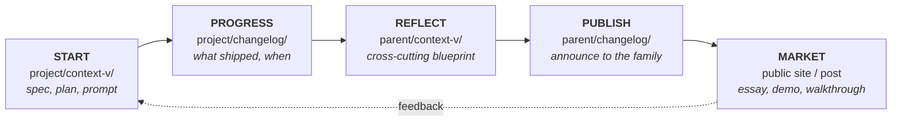

# The Five-Phase Lifecycle

How a unit of work moves from idea, to shipped, to shared lesson, to something the
outside world can see. The loop is an aspiration, not a mandate.

## Contents

- The loop
- Phase 1: Start
- Phase 2: Progress
- Phase 3: Reflect
- Phase 4: Publish
- Phase 5: Market
- When to skip phases

## The loop

| Phase | Where | What |
|---|---|---|
| Start | `project/context-v/` | Frame the work: spec, plan, prompt, or blueprint |
| Progress | `project/changelog/` | Log what shipped and when, linking back to the spec |
| Reflect | `parent/context-v/` | Lift the lesson to the cross-cutting level |
| Publish | `parent/changelog/` | Announce the change at the parent level |
| Market | Wherever the project talks publicly | Essay, docs page, demo, release post |

## Phase 1: Start

Frame the work before doing it, in the project's own `context-v/`: a spec (what and
why), a plan (the steps), and a blueprint if a known pattern applies. **Output:** at
least one document an agent can load as context for the build.

## Phase 2: Progress

Log what shipped in the project's `changelog/`: dated entries, each linking to the spec
or plan it implemented, brief and factual (what changed, why, what's next). **Output:** a
trail a human or agent can read to understand how the project evolved.

## Phase 3: Reflect

Lift learnings into the parent's `context-v/` once they matter beyond one child:

- "We solved X this way in `web`. Should it be a blueprint for `api` and `docs` too?"
- "We hit the same problem in three children. Time for a reminder."

**Output:** parent-level documents that aggregate insight across children.

## Phase 4: Publish

Announce at the parent level in the parent's `changelog/`: "New blueprint: X," "All
children now use pattern Y." **Output:** family-wide visibility of a project-level change.

## Phase 5: Market

A public-facing artifact where it fits: a blog post, docs page, gallery entry, demo
video, talk. **Output:** something an outsider can find, learn from, and link to.

## When to skip phases (open)

| Type of work | Realistic phases |
|---|---|
| Typo or one-line fix | Progress, maybe |
| Bug fix | Start (an issue) → Progress |
| New feature in one project | Start → Progress |
| Pattern that affects 2+ children | Start → Progress → Reflect |
| New convention for the whole tree | Start → Progress → Reflect → Publish |
| Any of the above worth discussing publicly | All five |

Skipping is fine; forgetting isn't. When a phase that probably matters gets skipped,
leave a refactor-debt marker (see `search-first.md`) so it can be picked up later.
